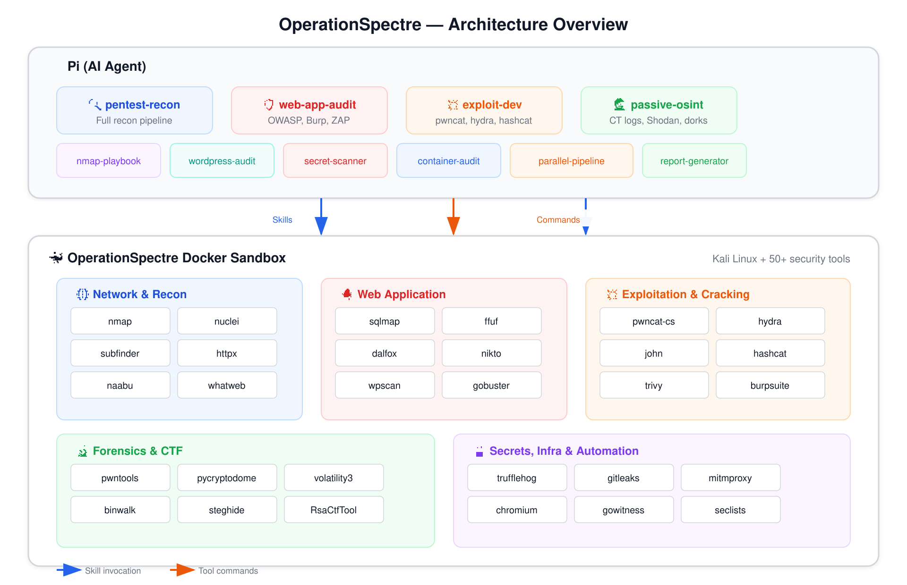
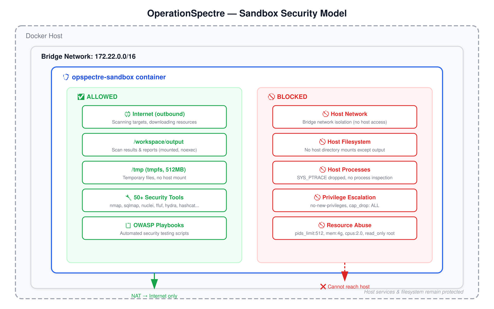

# OperationSpectre

> **AI tool kit for security operations built for [pi](https://github.com/badlogic/pi-mono).**
> A Debian-based Docker sandbox (~800 MB) with 60+ pre-installed security tools, orchestration playbooks, and pi skill integration — designed for penetration testing, CTF competitions, and security assessments.

```
pi (AI agent) ←→ OperationSpectre skills/playbooks ←→ Docker sandbox (Debian-slim + tools)
```

## ⚡ Quick Start (First-Time Setup)

> **IMPORTANT: You MUST build and start the Docker sandbox BEFORE running pi.**

### Step 1: Clone & Enter the Project

```bash
git clone https://github.com/your-repo/OperationSpectre
cd OperationSpectre
```

### Step 2: Build the Docker Sandbox (ONE-TIME)

```bash
# Recommended: use the build script (handles BuildKit caching)
./scripts/build.sh

# Or build manually
docker build -f containers/Dockerfile -t opspectre-full:latest .
```

**This takes 6-10 minutes on first build.** The image is ~800 MB with 60+ security tools pre-installed.

### Step 3: Start the Container (EACH SESSION)

```bash
docker compose -f containers/docker-compose.yml up -d
```

**The container runs in the background.** Verify it's running:

```bash
docker ps | grep opspectre-sandbox
```

### Step 4: Run Pi (AUTO-DETECT)

```bash
pi
```

**Pi will automatically:**
- ✅ Detect the `.pi/skills/` directory in the project
- ✅ Load all 18 security skills
- ✅ Connect to the running sandbox

**You're now ready!** Ask pi to:
- "Run an OWASP Top 10 scan against https://target.com"
- "Enumerate subdomains for example.com"
- "Crack this hash: 5f4dcc3b5aa765d61d8327deb882cf99"

### Stopping the Sandbox

```bash
docker compose -f containers/docker-compose.yml down
```

---

## 🎯 What It Is

OperationSpectre turns **pi** into a security operations workstation. It provides:

- 🐳 **Docker sandbox** — Debian Bookworm-slim container with 60+ security tools pre-installed
- 🎯 **Pi skills** — 18 domain-specific skill definitions for recon, exploitation, web audits, CTF, and more
- 📋 **Playbooks** — Automated OWASP Top 10, OSINT, CTF, and Burp Suite workflows
- 🔄 **Pipelines** — YAML-defined scan pipelines with parallel execution support

It is **not** an agent itself — it's the toolkit that powers agents.

## 🏗️ Architecture



> **Two-layer design:** Pi skills invoke commands that execute inside the hardened Docker sandbox with 60+ security tools.

## 📚 Advanced Usage

### Standalone CLI (Optional)

If you want to use the sandbox without pi:

```bash
uv sync
opspectre init
opspectre run "nmap -sV 192.168.1.1"
```

### CLI Commands

| Command | Subcommands | Description |
|---|---|---|
| `init` | — | Full setup: Docker check, pull image, start sandbox |
| `sandbox` | `start`, `stop`, `status` | Manage sandbox container |
| `shell` | `<command>` | Run shell command in sandbox |
| `run` | `<command>` | Run command (auto-starts sandbox) |
| `file` | `read`, `write`, `edit`, `list`, `search` | File operations in sandbox |
| `code` | `python <code>`, `node <code>` | Execute code in sandbox |
| `browser` | `navigate`, `snapshot`, `screenshot` | Browser automation |
| `runs` | `list`, `show` | Manage run history |
| `config` | `set`, `get` | Manage configuration |
| `performance` | `show`, `stats`, `config`, `clear` | Performance analytics |

### Makefile Targets

```bash
make install          # Install dependencies (no dev)
make dev-install      # Install with dev dependencies
make setup-dev        # Install + pre-commit hooks
make format           # Auto-format code (ruff)
make lint             # Lint code (ruff)
make typecheck        # Type check (pyright)
make check-all        # format + lint + typecheck
make test             # Run tests (pytest)
make pre-commit       # Run all pre-commit hooks
```

---

## 🧩 Pi Skills

The real power of OperationSpectre is its **pi skill library** — domain-specific instructions that teach the AI agent how to use each tool effectively.

> **Note:** Skills auto-load when you run `pi` from the OperationSpectre directory. You don't need to manually install them.

### Security Assessment

| Skill | Purpose |
|---|---|
| `pentest-recon` | Full recon pipeline: subfinder → httpx → nmap → nuclei → OSINT |
| `opspectre-security-suite` | Consolidated OWASP Top 10 testing with automated playbooks |
| `web-app-audit` | Full-stack web app security: Burp, sqlmap, ffuf, gospider |
| `wordpress-audit` | WordPress-specific: wpscan, enumeration, plugin vulns |
| `passive-osint` | Zero-footprint recon: CT logs, Wayback, Google dorks, Shodan |
| `nmap-playbook` | Structured nmap scans: quick, deep, stealth, UDP |

### Exploitation & Cracking

| Skill | Purpose |
|---|---|
| `exploit-dev` | Active exploitation: hydra, john, hashcat, medusa |
| `secret-scanner` | Find leaked secrets: trufflehog, trivy, gitleaks |
| `container-audit` | Container vulnerability scanning with trivy |

### CTF Competition

| Skill | Purpose |
|---|---|
| `ctf-skills` | Curated CTF technique library (web, forensics, crypto, stego) |
| `sandbox-tools` | Reference for all 60+ tools in the sandbox |
| `report-generator` | Generate structured pentest reports in markdown/PDF |

### Infrastructure

| Skill | Purpose |
|---|---|
| `docker-toolchain` | Build, test, and update the sandbox image |
| `parallel-pipeline-executor` | Run independent scan steps concurrently (60-80% faster) |
| `small-model-pipeline` | Lightweight pipeline runner for smaller models |
| `opspectre-dev` | Develop and test OperationSpectre itself |

### Code & Docs Retrieval

| Skill | Purpose |
|---|---|
| `jcodemunch` | Structured code search and retrieval |
| `jdocmunch` | Structured documentation retrieval |

---

## 🛡️ OWASP Top 10 Playbook

Built-in playbook for automated OWASP Top 10 (2021) testing:

```bash
# Inside the sandbox
source /opt/playbooks/owasp-top10-playbook.sh

# Full scan — all 10 categories
owasp_full_scan https://target.com

# Quick scan — fast triage (no sqlmap)
owasp_quick_scan https://target.com

# Individual categories
owasp_a03 https://target.com/login    # Injection
owasp_a10 https://target.com/fetch    # SSRF
```

### Additional Playbooks

| Playbook | Description |
|---|---|
| `osint-playbook.sh` | Passive reconnaissance (CT logs, Wayback, Google dorks, Shodan, GitHub) |
| `ctf-playbook.sh` | CTF challenge workflows (web, crypto, forensics, stego, pwn, RE) |
| `burpsuite-playbook.sh` | Burp Suite headless scanning operations |
| `scan-helpers.sh` | Shared output directory utilities |
| `rate-limit-helpers.sh` | WAF evasion and rate-limit-aware scanning defaults |

### Categories Covered

| # | Category | What It Tests |
|---|---|---|
| A01 | Broken Access Control | IDOR, privilege escalation, path traversal, CORS |
| A02 | Cryptographic Failures | TLS ciphers, sensitive data exposure, cookie security |
| A03 | Injection | SQLi, XSS, SSTI, command injection, XXE |
| A04 | Insecure Design | User enumeration, rate limiting, business logic flaws |
| A05 | Security Misconfiguration | Exposed endpoints, debug modes, backup files, default creds |
| A06 | Vulnerable Components | Known CVEs, Log4j, tech fingerprinting |
| A07 | Authentication Failures | Default creds, brute force, account lockout, session management |
| A08 | Software/Data Integrity | JWT manipulation, deserialization, SRI, parameter tampering |
| A09 | Logging Failures | Error-based info leakage, verbose responses, dev comments |
| A10 | SSRF | Internal port scanning, cloud metadata, protocol smuggling |

---

## 🔄 Pipelines

YAML-defined scan pipelines with parallel execution support:

| Pipeline | Steps | Description |
|---|---|---|
| `pentest.yaml` | 7 steps | Full pentest recon & vuln assessment |
| `parallel_pentest.yaml` | 9 steps | Optimized pentest with 5 parallel execution phases |
| `ctf-web.yaml` | 7 steps | CTF web challenge pipeline |
| `ctf-crypto.yaml` | 4 steps | CTF crypto analysis pipeline |

Run with the pipeline runner:

```bash
python scripts/pipeline_runner.py pipelines/pentest.yaml
python scripts/parallel_pipeline_runner.py pipelines/parallel_pentest.yaml
```

---

## 🧰 Sandbox Tools

### Network & Recon
nmap, masscan, nuclei, subfinder, httpx, naabu, whatweb, katana, gospider, gau, waybackurls, interactsh-client

### Web Application
sqlmap, ffuf, dalfox, nikto, wpscan, wapiti, gobuster, arjun, wafw00f, webtech, dirsearch

### Exploitation
hydra, john, hashcat, medusa, crunch, cewl, searchsploit (exploitdb)

### Forensics & CTF
pwntools, pycryptodome, gmpy2, sympy, z3-solver, RsaCtfTool, binwalk, steghide, stegseek, zsteg, exiftool, foremost, radare2

### Reverse Engineering
radare2, apktool, CFR (Java decompiler), gdb, checksec

### Network Capture
tshark, wireshark-common

### Password Cracking
hashcat, john, hydra, medusa, crunch, cewl, wordlists (rockyou.txt, SecLists)

### Container & Secrets
trivy, trufflehog, gitleaks, semgrep, bandit

### Infrastructure
Burp Suite Community, Caido CLI, Obscura (headless browser), gowitness

### Code Analysis
semgrep, bandit, retire (npm), eslint, js-beautify, jshint

### Reporting
pandoc, texlive (LaTeX)

### Full tool reference
See [`.pi/skills/sandbox-tools/SKILL.md`](.pi/skills/sandbox-tools/SKILL.md)

### Tools Not Included

The Debian-slim build (~800 MB) drops these from the legacy Kali build (~3 GB):

| Tool | Category | Reason |
|---|---|---|
| **Metasploit** (msfconsole) | Exploitation framework | Heavy (~500 MB); use hydra + searchsploit instead |
| **Amass** | Subdomain enumeration | Redundant with subfinder + passive OSINT playbook |
| **Feroxbuster** | Directory brute-forcing | Redundant with ffuf + gobuster |
| **CrackMapExec** | AD/post-exploitation | Requires Kali metapackages |
| **evil-winrm** | WinRM exploitation | Requires Kali metapackages |
| **Responder** | LLMNR/NBT-NS poisoner | Requires Kali metapackages |
| **aircrack-ng** | Wireless attacks | Requires Kali metapackages |
| **Bloodhound / Ghidra** | AD/RE | Requires Kali metapackages |

To add any of these back, use `containers/Dockerfile.base` (Kali-based) or edit `containers/Dockerfile` and rebuild.

---

## 📁 Project Structure

```
OperationSpectre/
├── .pi/
│   └── skills/              # Pi skill definitions (auto-loaded by pi)
│       ├── pentest-recon/
│       ├── opspectre-security-suite/
│       ├── web-app-audit/
│       ├── exploit-dev/
│       ├── passive-osint/
│       ├── nmap-playbook/
│       ├── wordpress-audit/
│       ├── secret-scanner/
│       ├── container-audit/
│       ├── sandbox-tools/
│       ├── docker-toolchain/
│       ├── parallel-pipeline-executor/
│       ├── small-model-pipeline/
│       ├── opspectre-dev/
│       ├── report-generator/
│       ├── ctf-skills/
│       ├── jcodemunch/
│       ├── jdocmunch/
│       └── SKILLS_INDEX.md
├── containers/
│   ├── Dockerfile           # Debian-slim sandbox (primary)
│   ├── Dockerfile.base      # Kali-based image (legacy/full)
│   ├── docker-compose.yml   # Container orchestration
│   ├── docker-entrypoint.sh # Startup script (venv, tool server)
│   ├── owasp-top10-playbook.sh
│   ├── osint-playbook.sh
│   ├── ctf-playbook.sh
│   ├── burpsuite-playbook.sh
│   └── wrappers/            # Tool wrapper scripts
├── pipelines/               # YAML scan pipeline definitions
│   ├── pentest.yaml
│   ├── parallel_pentest.yaml
│   ├── ctf-web.yaml
│   └── ctf-crypto.yaml
├── scripts/                 # Build, pipeline runners & automation
│   ├── build.sh
│   ├── pipeline_runner.py
│   └── parallel_pipeline_runner.py
├── docs/                    # Documentation
│   ├── getting-started/
│   ├── playbooks/
│   ├── reference/
│   └── about/
├── output/                  # Scan results (mounted from sandbox)
├── src/opspectre/           # Python source (CLI, sandbox, reporting)
└── Makefile                 # Build, lint, test targets
```

---

## ⚙️ Environment Variables

| Variable | Default | Description |
|---|---|---|
| `OPSPECTRE_IMAGE` | `opspectre-full:latest` | Docker image name |
| `OPSPECTRE_TIMEOUT` | `120` | Command timeout in seconds (1-3600) |
| `OPSPECTRE_OUTPUT_LIMIT` | `1048576` | Max command output in bytes (1KB-256MB) |
| `TOOL_SERVER_PORT` | `48081` | Port for the sandbox tool server (container override: 9100) |
| `TOOL_SERVER_TOKEN` | `changeme` | Auth token for the sandbox tool server |
| `OPSPECTRE_SANDBOX_EXECUTION_TIMEOUT` | `120` | Sandbox command execution timeout (seconds) |
| `OPSPECTRE_PERFORMANCE_LOGGING` | `true` | Enable performance monitoring |
| `OPSPECTRE_METRICS_INTERVAL` | `60` | Metrics collection interval (10-3600s) |
| `OPSPECTRE_SLOW_OPERATION_THRESHOLD` | `5000` | Threshold to flag slow operations (ms) |

---

## 🔒 Sandbox Security

The Docker sandbox is **hardened by default** so that the container (and any agent like pi running inside it) can only access:

- ✅ **Output folder** (`./output` → `/workspace/output`) — read/write for scan results and reports
- ✅ **Internet** — outbound access for scanning targets and downloading resources

Everything else is **blocked**:

| Restriction | Details |
|---|---|
| 🚫 Host network | Bridge network (`172.22.0.0/16`) — cannot see host services, LAN devices, or pi agent on host |
| 🚫 Host filesystem | No host directory mounts (except output with `noexec,nosuid,nodev`) |
| 🚫 Host `/tmp` | Not mounted — cannot access host temp files, sockets, or session data |
| 🚫 Host processes | `SYS_PTRACE` dropped — cannot inspect or attach to host processes |
| 🚫 Network admin | `NET_ADMIN` dropped — cannot modify routes, iptables, or create tunnels |
| 🚫 Privilege escalation | `no-new-privileges:true`, `privileged:false` |
| 🚫 Syscall bypass | Docker's default seccomp profile active (not `unconfined`) |
| 🚫 Root filesystem writes | `read_only:true` — only tmpfs paths (`/tmp`, `/var/run`, `/var/tmp`, `/home/pentester`) are writable |
| 🚫 Fork bombs | `pids_limit:512` |
| 🚫 Resource abuse | `mem_limit:4g`, `cpus:2.0` |
| 🚫 Unnecessary capabilities | `cap_drop: ALL` — only `NET_RAW` and `NET_BIND_SERVICE` re-added |

### How It Works



> The container can only reach the internet (via NAT) and write to `/workspace/output`. All host access is blocked.

### Security Checklist

If you modify the compose files, make sure these safeguards stay in place:

- [ ] `network_mode: host` is **never** used — always use a bridge network
- [ ] `seccomp=unconfined` is **never** set — use Docker's default profile
- [ ] `cap_drop: ALL` is always present before any `cap_add`
- [ ] `no-new-privileges:true` is always set
- [ ] `read_only: true` is set with tmpfs for writable paths
- [ ] Volume mounts use `noexec,nosuid,nodev` flags
- [ ] `SYS_PTRACE` and `NET_ADMIN` are **not** in `cap_add`
- [ ] `/tmp` host mount is **never** used
- [ ] Published ports are bound to `127.0.0.1` only (not `0.0.0.0`)

---

## 📄 License

Apache-2.0
